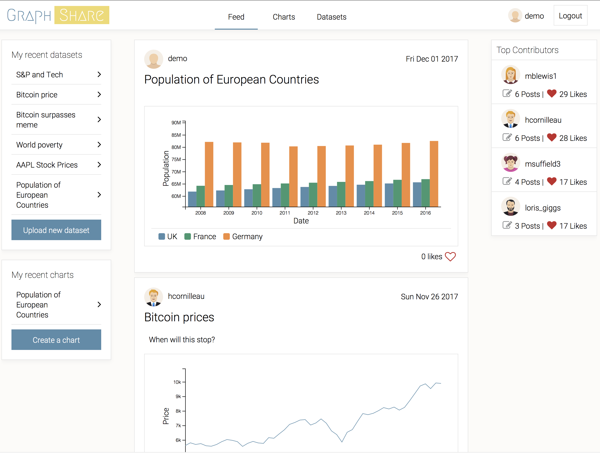
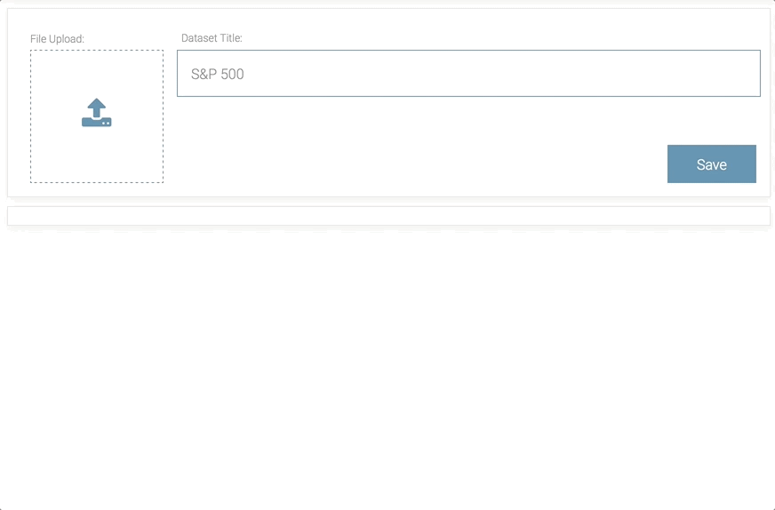
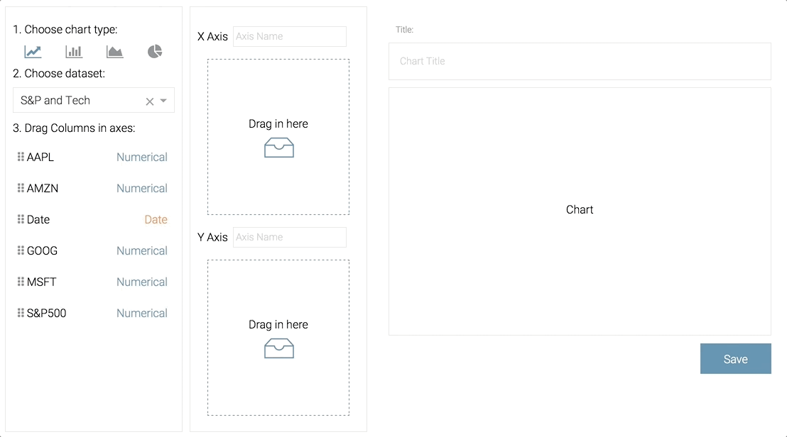
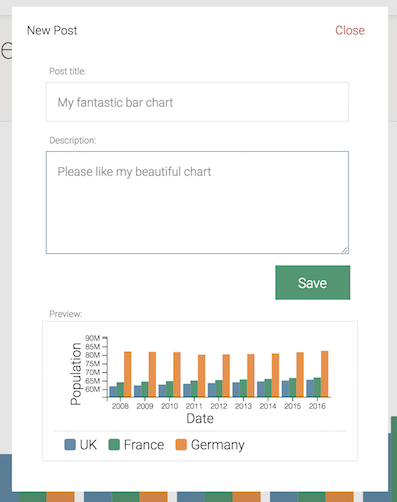
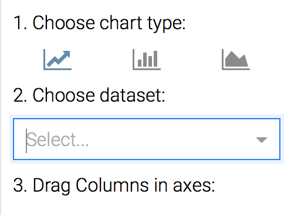
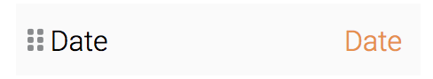
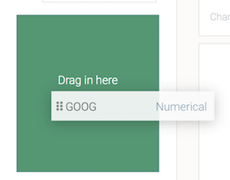

# [Graph Share](https://graphshare.herokuapp.com/#/)


Graph Share is a full stack web application inspired by Chart.io. The website allows users to upload, create, share and discover charts.



## Technologies

The backend is written in [Ruby on Rails](http://rubyonrails.org/) using a PostrgreSQL database for rapid developement and flexibility. 

The frontend is written with [React](https://reactjs.org/) and uses [Redux](https://redux.js.org/). React was chosen to create a dynamic single page application and redux for consistent behaviour and easier debugging.

The charts are built using [D3Js](https://d3js.org/) and SVG. D3 with SVG, although more complex than ready built libraries, provides complete control over the chart look.

The draggable components are built on [React DnD](http://react-dnd.github.io/react-dnd/)


## Features

### Uploading data
You can upload JSON, CSV and TSV data on the website. The parser will attempt to assign a type to each column between Categorical, Numerical or Date. The Date category has a subtype to parse the correct format.



### Creating Charts
You can then use these datasets to create charts. You first chose a chart type between Line Chart, Bar Chart or Area Chart. Then, you can select a dataset among the ones you uploaded. By dragging and dropping on two axes, you can dynamically modiy your chart.



### Sharing creations with the world
When you are done and proud of your chart or your newly uploaded dataset. You can share it with the community by writing a new post. The other users will then be able to like your post to validate your awesomeness.



## Challenges

### Storing charts
Storing charts in the database was a challenge. Users should be able to preserve their chart without keeping the dataset and to force a type on columns. To preserve the chart and avoid unnecessary processing time, the data is only analysed at import and the type is then stored along the data. To serve the correct chart based on the API response of the database, I created a Chart Factory.

Chart factory pattern
```javascript
class ChartFactory {
  static build(chart, width, height) {
    switch (chart.chart_type) {
      case ChartType.LINE:
        return <LineChart data={convertData(chart.data)} width={width} height={height} />;
      case ChartType.BAR:
        return <BarChart data={convertData(chart.data)} width={width} height={height} />;
      case ChartType.AREA:
        return <AreaChart data={convertData(chart.data)} width={width} height={height} />;
      default:
        return <div className="empty-chart" />;
    }
  }
}

```

### Mixing D3 and React
A second challenge came from using D3 with React. D3 is usually manipulating the dom in order to create charts. However, React generates a virtual DOM and should be responsible for modifying it. To ensure that no conflict would arise, I used D3 to calculate the position and generate the coordinates but React to render the components. Only one exception was made for creating the axis as D3 needs access to the DOM. 

For example, the line of the line chart is generated by D3 and rendered by React as follows:

```javascript

// D3 is used to calculate the scales in a scale.js file
const [scaleX, scaleY] = Scale(rows, width, height);

// D3 is used to generate the coordinates of a line using the scales
const lineFunction = line()
    .x(d => scaleX(d[xAxis]))
    .y(d => scaleY(d[columName]));

// React creates a SVG path that will be renderred in a component
const path = <path d={lineFunction(rows)} transform={`translate(${marginLeft}, 0)`} className={`color-stroke-${idx + 1}`} />;

```

### Making the website user friendly
The third challenge came after initial testing revealed that users would not understand that they should drag and drop. To make the website user friendly, I took the following steps:
1. Indicate the steps needed to create the chart



2. Add an icon on the column names to indicate drag and drop



3. Visual clue to indicate whether a data column can be dropp on an axis



## What's next?
- Add additional chart types
- Allow users to force the type of columns and input a date format
- Add comments to the feed